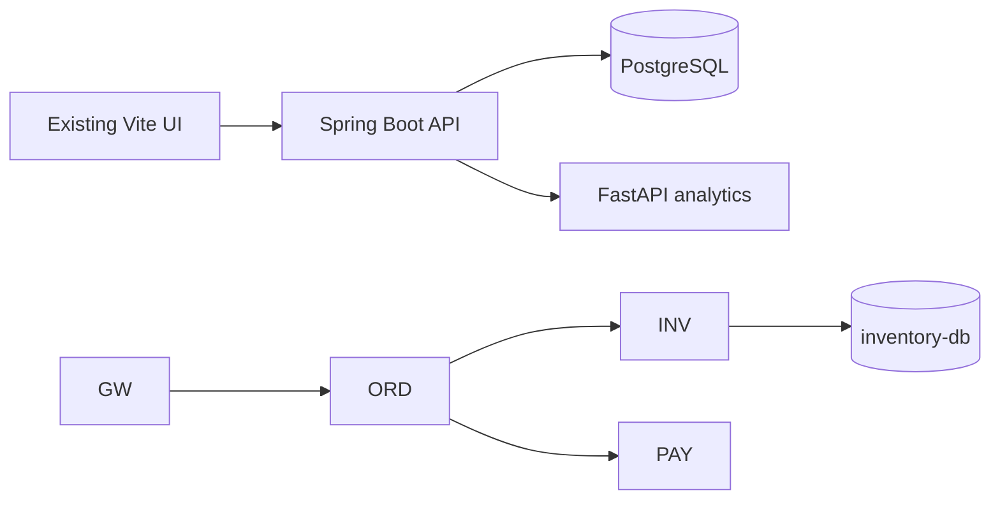

# Architecture

RCA ranks normalized anomaly (30%), temporal precedence (25%), dependency reach (20%), propagation consistency (15%), and metric correlation (10%). It is a transparent heuristic, not a GNN or causal-discovery claim.
